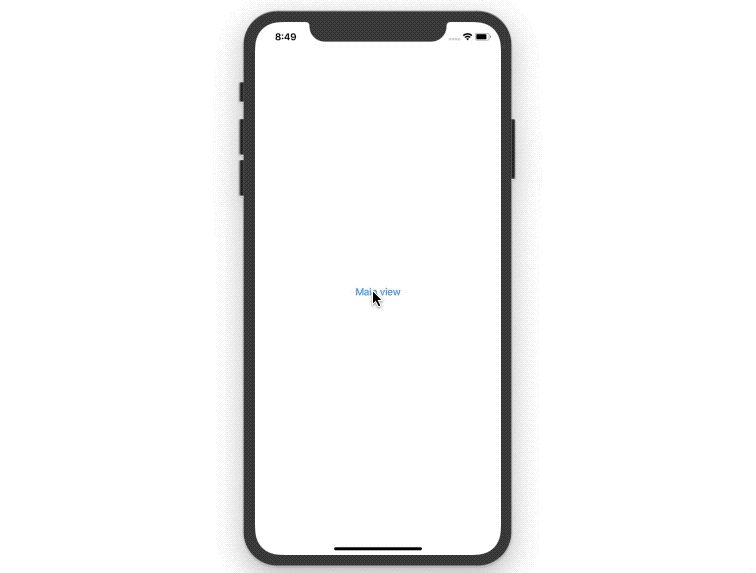

# ModalView

SwiftUI An analogue of `NavigationView` that provides a convenient interface of displaying modal views.

## How to use
### Step 1
Add a dependency using Swift Package Manager to your project: [https://github.com/diniska/modal-view](https://github.com/diniska/modal-view)

#### Step 2
Import the dependency

```swift
import ModalView
```

### Step 3
Use `ModalPresenter` and `ModalLink` the same way you would use `NavigationView` and `NavigationLink`:

```swift
struct ContentView: View {
    var body: some View {
        ModalPresenter {
            ModalLink(destination: Text("Modal View")) {
                Text("Main view")
            }
        }
    }
}
```

### Result



Learn more here: [Display Modal View with SwiftUI](https://medium.com/@diniska/modal-view-in-swiftui-3f9faf910249)


